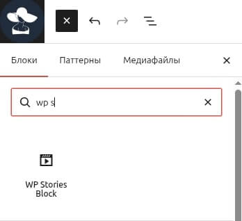
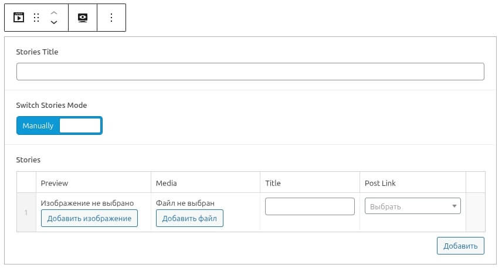

# WP Stories Block

WP Stories Block is a WordPress plugin that adds an ACF-powered Gutenberg block for displaying stories in an Instagram-style format.

It renders a horizontal stories feed on the frontend and opens stories in a fullscreen modal with autoplay, swipe navigation, and pause-on-hold behavior.

---

## Features

- ACF Gutenberg block for stories
- Horizontal stories timeline
- Fullscreen modal viewer
- Autoplay with progress bars
- Swipe left / right navigation
- Pause on hold (press and hold to pause story)
- Image and video support
- Video duration-based playback (max 15 seconds)
- Profile link, avatar, and title inside the modal
- Mobile-friendly (touch & pointer events)
- BEM-based class naming with `wpstb` prefix

---

## Requirements

- WordPress 6.0+
- Advanced Custom Fields (ACF) PRO or Free (with block support)
- PHP 7.0+

---

## How to use

### 1. Add the block

1. Open a page in the Gutenberg editor.
2. Add the **WP Stories Block** from the **Widgets** category.

---

### 2. Configure block fields

The block provides several configuration options:

- **Stories Title**  
  Optional heading displayed above the stories feed.

- **Switch Stories Mode**
    - **Manually** – universal mode. Stories are added manually using the repeater field and will work with **any theme**. This is the recommended and most flexible option.
    - **Random** – theme-specific mode. Stories are loaded automatically from the **`models` CPT** that have video (ACF field). This option depends on the current theme structure and is intended for projects where the `models` post type already exists.

- **Stories** (Manual mode)
    - Preview image
    - Media (image or video)
    - Title
    - Post link (models, posts, or pages)

- **Number of stories** (Random mode)  
  Controls how many stories are displayed.

---

### 3. Save the page

After saving, the stories feed will appear on the frontend.

Clicking a story opens it in a fullscreen modal.

---

## Frontend behavior

- Stories open in a fullscreen modal
- Images autoplay for a fixed duration
- Videos play for their real duration, but **not longer than 15 seconds**
- Swipe left / right to navigate between stories
- Press and hold to pause the story and progress bar
- Release to continue playback
- Profile avatar, name, and link are displayed in the modal header

---

## Notes & limitations

- On iOS, autoplay with sound is usually blocked by the browser.  
  Sound can only be enabled after a direct user interaction (tap).
- Video autoplay may start muted depending on browser policies.
- Class naming follows **BEM** with the `wpstb-` prefix.

---

## Development notes

- All JavaScript interactions rely on `data-wpstb-*` attributes to avoid tight coupling with CSS classes.
- CSS uses a unified `wpstb` BEM naming convention.
- The modal and timeline logic are isolated inside the plugin and do not depend on the theme.

---

## License

MIT

